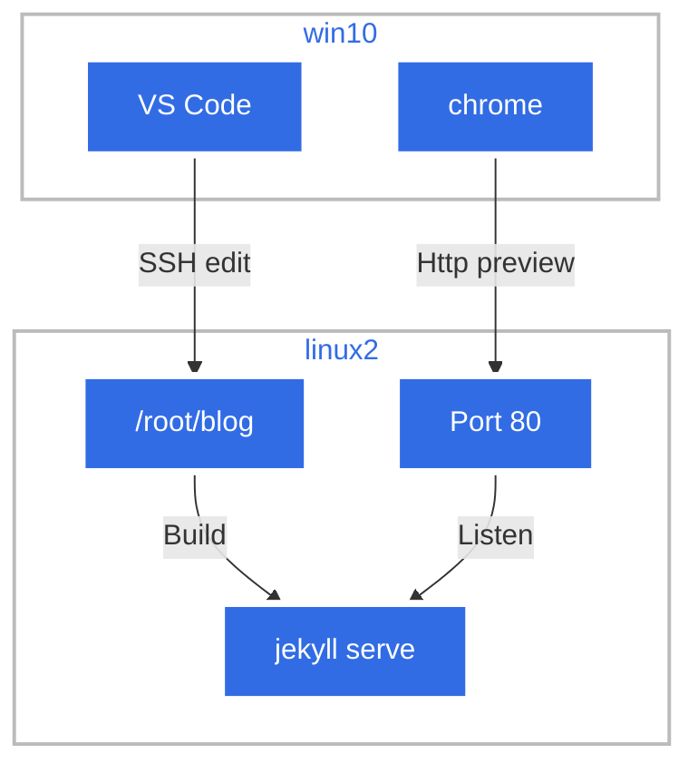
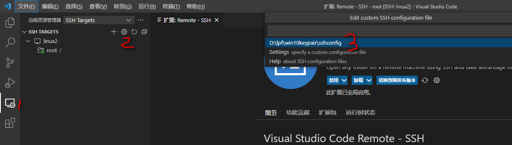

jekyll 需要框架编译才能生成静态网页，如果每次都提交github，调试过程很痛苦。我想充分利用hyper-v里运行的linux2，所以以这个架构来处理





## 1.win10 设置key pair

```
ssh-keygen -t rsa -b 4096 -f "d:\win10"
```

win10.pub添加到/root/.ssh/authorized_keys

## 2.vs code 添加插件 Remote - SSH、Remote Development (略)

然后设置连接



sshconfig内容如下,sshconfig和密钥在同一个文件夹，没有指定IdentityFile

```
Host linux2
	HostName 192.168.176.120 
	User     root
	
```

格式

```
Host remotehost.yourcompany.com
    User yourname
    HostName another-host-fqdn-or-ip-goes-here
    IdentityFile ~/.ssh/id_rsa-remote-ssh
```

## 3.linux2上安装ruby,jkyll

 具体参考https://jekyllrb.com/docs/step-by-step/01-setup/

主要命令

```
amazon-linux-extras #使用的是linux2 
amazon-linux-extras enable 39#要求安装ruby2.6以上
yum install ruby ruby-irb rubygem-rake rubygem-json rubygems ruby-devel 
yum group install "Development Tools"
gem install jekyll bundler
```


### 4.运行jekylll

git clone 源项目，然后在这个目录[/root/blog/oplancelot.github.io]#下执行

jekyll 绑定到0.0.0.0而不是127.0.0.1

```
bundle exec jekyll serve -w -H 0.0.0.0 -P 80 
```

参数参考https://jekyllrb.com/docs/configuration/options/

然后就可以从vscode调试了,文件变更后立刻反映，提高了效率

## 5.参考鸣谢

https://shipit.dev/posts/kubernetes-overview-diagrams.html

https://insujang.github.io/2019-09-28/jekyll-vscode/

https://powers-hell.com/2021/07/25/build-a-jekyll-development-environment-with-vs-code-remote-containers/