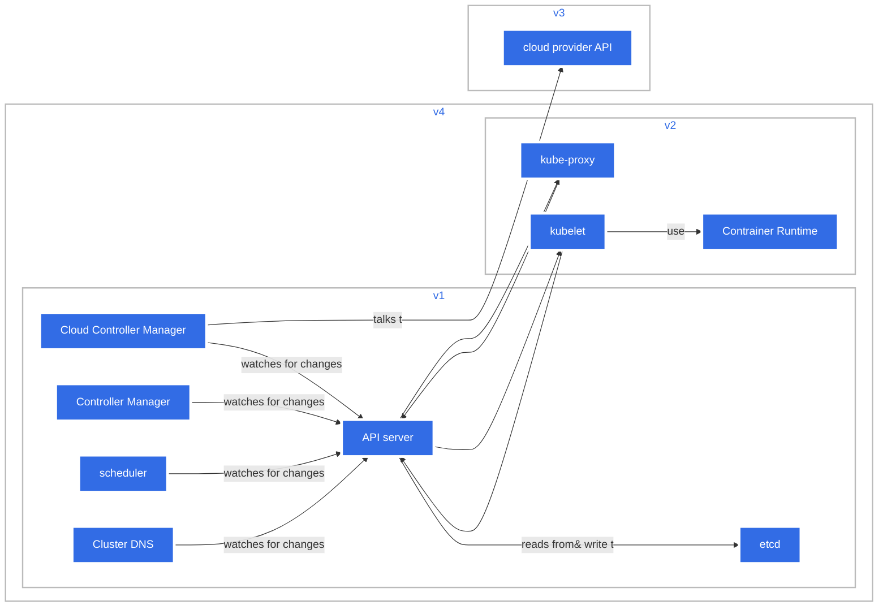

### Kubernetes Architecture




------


```
graph LR

   subgraph v3
   ccm-->cpa[cloud provider API <br> api to managercloud resources];
   end
    subgraph v4
 subgraph v1
     ccm[Cloud Controller Manager<br>runs cloud controller processes that take care of eg lb ]--watches for changes-->API[API server];
     cm[Controller Manager<br>runs all built-in controllers,like Node or Replication Controller]--watches for changes-->API[API server];
     sch[scheduler <br> distributes unscheduled workloads across avaialbe worker nodes]--watches for changes-->API[API server];
     dns[Cluster DNS<br> Provides in-cluster DNS for Pods and Serveris.usually provides using coredns'k8s plugin]--watches for changes-->API[API server];
    API[API server<br>Tracking state of all cluster components and managing interactions betweent them]--reads from& write to--> etcd[etcd<br>key value store for all cluster configuration data];
  end
  subgraph v2
   API-->proxy[kube-proxy<br>manages network connections to the node's podes e.g.using iptalbes rules];
   API-->kubelet[kubelet];
   proxy[kube-proxy]-->API;
   kubelet[kubelet<br>manages containers based on incoming pod specifications]-->API;
   kubelet--use-->cr[Contrainer Runtime<br>runtime that implements the CRI or containerd];
   end
end


 classDef plain fill:#ddd,stroke:#fff,stroke-width:4px,color:#000;
 classDef blue fill:#326ce5,stroke:#fff,stroke-width:4px,color:#fff;
 classDef cluster fill:#fff,stroke:#bbb,stroke-width:2px,color:#326ce5;
 class cm,ccm,sch,etcd,dns,API,proxy,kubelet,cr,cpa blue;
 class client plain;
 class works cluster;
```

