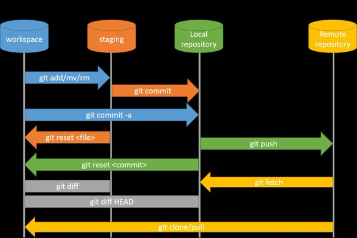

gitlab工作流

### 基本概念

使用 Git 一定要理解三个概念：工作目录，暂存区（staging），仓库（repository）。见下图所示：

### 分支管理

branch 分支merge 到main

### 实现方式

开源软件的协作方式不适合小团队，就下放部分权限，使用“保护分支”的方式进行开发。为组内成员赋予 Developer 角色，同时使其不可修改 受保护分支。所有人都在原始仓库上工作，流程再次变为如下方式：

- 成员 Clone 原始仓库到本地
- 基于要修改的分支**main**，创建新的分支**issue1~n**
- 本地修改和提交 此时 **tag** ver1.0-20220114-dev/stg/prd
- 推送新分支到原始仓库 
- 在原始仓库中基于新分支向目标保护分支发起 **issue1-->main**
- 审核者 review 代码 
- 管理员 Merge 代码  
- 提交者删除新分支**issue1~n**

所有人都基于同一个仓库开发，就不用考虑同步仓库代码的问题，每次执行 `git pull` 之后，要修改的分支就已经最新。 而且，组内成员都可以创建 label，进一步详细标示自己的修改，也是一种高效的方式。

### 基于最佳实践的原则

-  **Everyone starts from main and targets main.**

  开发者基于“main"分支

  clone`main`

   check out `main`

   build a feature,`issue1`

   commit  `issue1`

  merge request ,`issue1` to `main`

  delete `issue`

  fetch `main` again

- **.Fix bugs in main first and release branches second.** 

  bug在`main`里处理，然后再merge到realeases

-  **Deployments are automatic based on branches or tags** 

  基于tags部署,回滚同理。

-  **Tags are set by the user, not by CI.** 

  tag由开发者创建，原则上按发布版本来打标签，比如ver20220113-1.0

-  **Deployments are automatic based on branches or tags** 

  基于tags部署,回滚同理。

-  **Pushed commits are never rebased.** 

  变基慎用，目前阶段考虑使用merge处理

-  **Commit messages reflect intent.** 

  提交commit时，一定要注释改了哪些内容，以及为什么这么改。

-  **Use feature branches rather than direct commits on the main branch** 

  最佳实践建议为每个feature建立分支，而不是在main上处理。

-  **Test all commits, not only ones on the main branch.** 

-   **. Run every test on all commits.** 

管理员使用 `rebase -i` 的方式进行 Merge MR。这样可以保持主分支的 commits 记录呈现一种线性的状态。管理员将 MR 中的多次提交 Squash 成一次，在提交的日志中写明 `Closes !id`。通过 MR 的 id 依然可以看到当时的修改详细记录。（视情况而定，还是考虑使用merge 来处理，变基操作慎用）

参考

https://docs.gitlab.com/ee/topics/gitlab_flow.html

https://www.infoq.cn/article/9DoTSVlWSczNBxJpxfqE

https://about.gitlab.com/topics/version-control/what-is-gitlab-flow/

https://about.gitlab.com/topics/version-control/what-are-gitlab-flow-best-practices/

https://yixinglu.gitlab.io/gitlab-workflow.html

https://blog.csdn.net/weixin_41196185/article/details/104748543