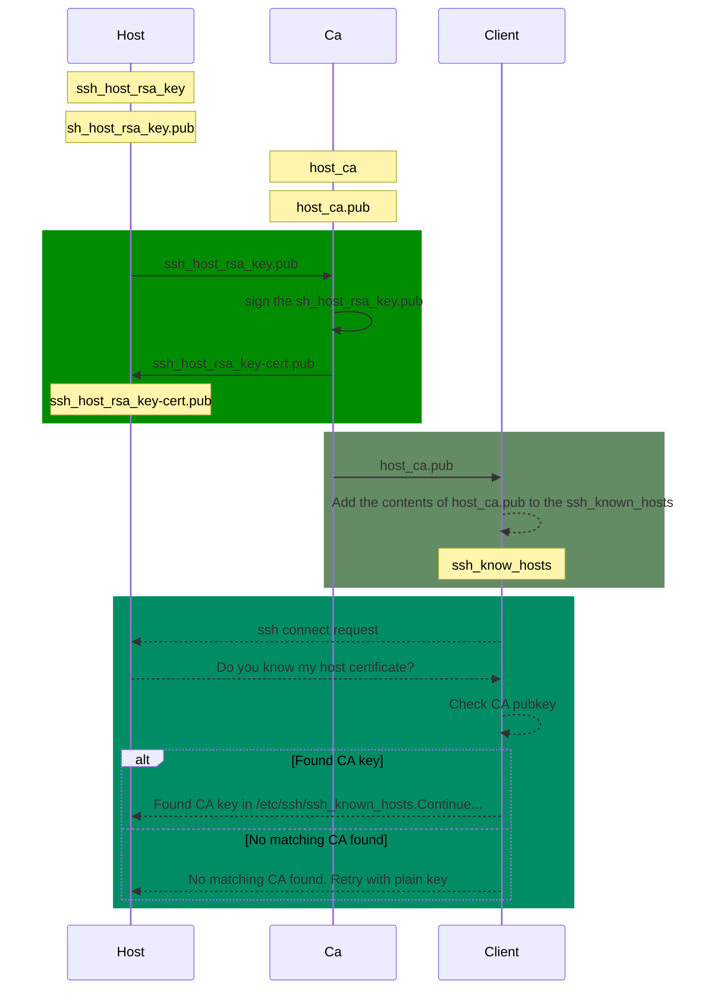

# `Client`信任`CA`的同时就信任所有它签名过的`host certificate`.

## 0.the sequence diagram of SSH host certificates.
## SSH主机证书的时序图。
 The process of using SSH host certificates is as follows.
 使用SSH主机证书的过程如下。





实现效果

1.初次登陆时不会再出现

`The authenticity of host 'host1.550w.dev' can't be established.
RSA key fingerprint is SHA256:GAGcmnsWDI8sGinhB5W1PZmGnILkl6tWck9mMjLlpyw.
Are you sure you want to continue connecting (yes/no/[fingerprint])? `

这个提示会打断自动交互的脚本或者ansible 等。


2.不会出现

`WARNING: REMOTE HOST IDENTIFICATION HAS CHANGED! `

这个提示对普通用户来说是比较难判断的。


## 1.建立HOST CA证书

**注意：**`在CA服务器上操作，建立强密码，每次颁发时需要`

CA 证书建立时，host和user没有什么不同
```bash
#host和user分开建立，主要考虑管理方面。比如host更为稳定，轮换时间更长点？
ssh-keygen -t rsa -b 4096 -f host_ca -C host_ca
#存在/root/.ssh/host_ca

```


## 2.Issuing host certificates 
颁发主机证书

将`Host`里的`/etc/ssh/ssh_host_rsa_key.pub` ，发送给`CA`


然后`Ca`签名,生成`ssh_host_rsa_key-cert.pub`

**注意：**`在Ca签名`
```bash
# ssh-keygen -s host_ca -I host1.550w.dev -h -n host1.550w.dev -V +52w ssh_host_rsa_key.pub
Enter passphrase: 
Signed host key ssh_host_rsa_key-cert.pub: id "host1.550w.dev" serial 0 for host1.550w.dev valid from 2023-06-15T16:03:00 to 2024-06-13T16:04:56

# ll ssh*
-rw-r--r-- 1 root root 2385  6月 15 16:05 ssh_host_rsa_key-cert.pub
-rw-r--r-- 1 root root  748  6月 15 16:02 ssh_host_rsa_key.pub

# ssh-keygen -Lf ssh_host_rsa_key-cert.pub 
ssh_host_rsa_key-cert.pub:
        Type: ssh-rsa-cert-v01@openssh.com host certificate
        Public key: RSA-CERT SHA256:7OzXj+yLh1C99qFL3qwp6ZRnppBkjlI+tuLd6JzBD1Q
        Signing CA: RSA SHA256:vsZ/Qf6gHrLnRBJiPh7DtEiSs8DSSjvgtEmWvSijtEg (using rsa-sha2-512)
        Key ID: "host1.550w.dev"
        Serial: 0
        Valid: from 2023-06-15T16:03:00 to 2024-06-13T16:04:56
        Principals: 
                host1.550w.dev
        Critical Options: (none)
        Extensions: (none)
```

然后`Ca`将`user-key-cert.pub`返回给`Host`


## 3.Host配置sshd-config

**注意：**`在Host操作`

`host`此时必须存在
`/etc/ssh/ssh_host_rsa_key-cert.pub`


编辑sshd_config，添加
```content
HostCertificate /etc/ssh/ssh_host_rsa_key-cert.pub
```

重启服务生效
```bash
systemctl restart sshd
```


## 4.Client连接Host

**注意：**`在Client操作`

将主机证书公开密钥`host_ca.pub`放在 `～/.ssh/know_hosts`（当前用户）或者`/etc/ssh/ssh_know_hossts`（全局）

前面添加 `@cert-authority *.550w.dev`，注意不要换行。

类似下面

```content

@cert-authority *.550w.dev ssh-rsa AAAAB3NzaC1yc2EAAAADAQABAAACAQDAYcV+iyah8UbNCDaSDxtDzOk2j7XOMW3DOzQGBXPfzvqbA64C4LRgiMeHxjiw/qM5P2qQqdmTM0USEpr2jQezW5P2G78hfc13XWDajoIFvy4hufiKgSj/1KwGy/aoGs+R8u1wLv+gMjyRhlXRH137XFZLmtqGpoOb3My7ulo3CizWIQELTf0WZfuFR3LEVHMvv+/PhGuuwYRIvJSvnlUGVFphvwjKi7/YkMrw3ZpWJA2THCM+fjsoGCCzjt2h25ny6okbeqDi/6M4NAsUJY+8L90BuZE7jNRHifr3+abBaCKjwCGEvT9pc4T2pumjgJ4nXlyiPd1ANF0nxg/TjAEwfgHYPOw1QWxVrCl8FRTzuY88axI0kshqlewDgtZCDxR+uz+1no7ZxebVThKhYo64amvNyFtKmVsuDmU+BjIjVPKWy4ZAJ+z84soFHVO+q2eyGJrZjgrRQznWekwDbUcHDcQ4NtH4o6VTf01iAtX709uR7mMXC1S/baAinHyUEXkS3ybSuw4ZCuUVIZrwIigKhYHGgzl7Tj80jfF3uUljZ5tM08wYGjxYpfI+8KvT1KBihkWKfG0UzMU+P4OyefiBkm9zy5DP7U+Uculg/Rgvkisf/8+CuezwatQwbvodorW9vbeIMCfRNXh5iV8OPIojLNafkyJ+ZygnJ7Xp30YO0w== host_ca
```
这样只需要添加过一次，所有在这个`Client` 机器上登陆发行过证书的`Host`时，都不会再有提示了。


```bash
ssh root@host1.550w.dev
```
不要连接
```bash
ssh root@11.22.33.44
```
因为发行证书时指定"FQDN" `host1.550w.dev`，这样host cerificate不会生效。

**注意：** 需要设置dns解析，或者添加到`/etc/hosts`。

"FQDN" 是 "Fully Qualified Domain Name" 的缩写，指的是完全合格域名


<details><summary>使用ssh certificate 登陆过程debug</summary>


```bash
 # ssh -i ~/certificate/user/clien-root root@host1.550w.dev -v
OpenSSH_8.4p1 Debian-5+deb11u1, OpenSSL 1.1.1n  15 Mar 2022
debug1: Reading configuration data /etc/ssh/ssh_config
debug1: /etc/ssh/ssh_config line 19: include /etc/ssh/ssh_config.d/*.conf matched no files
debug1: /etc/ssh/ssh_config line 21: Applying options for *
debug1: Connecting to host1.550w.dev [11.22.33.44] port 22.
debug1: Connection established.
debug1: identity file /root/certificate/user/clien-root type 0
debug1: identity file /root/certificate/user/clien-root-cert type 4
debug1: Local version string SSH-2.0-OpenSSH_8.4p1 Debian-5+deb11u1
debug1: Remote protocol version 2.0, remote software version OpenSSH_8.2p1 Ubuntu-4
debug1: match: OpenSSH_8.2p1 Ubuntu-4 pat OpenSSH* compat 0x04000000
debug1: Authenticating to host1.550w.dev:22 as 'root'
debug1: SSH2_MSG_KEXINIT sent
debug1: SSH2_MSG_KEXINIT received
debug1: kex: algorithm: curve25519-sha256
debug1: kex: host key algorithm: rsa-sha2-512-cert-v01@openssh.com
debug1: kex: server->client cipher: chacha20-poly1305@openssh.com MAC: <implicit> compression: none
debug1: kex: client->server cipher: chacha20-poly1305@openssh.com MAC: <implicit> compression: none
debug1: expecting SSH2_MSG_KEX_ECDH_REPLY
debug1: Server host certificate: ssh-rsa-cert-v01@openssh.com SHA256:GAGcmnsWDI8sGinhB5W1PZmGnILkl6tWck9mMjLlpyw, serial 0 ID "host1.550w.dev" CA ssh-rsa SHA256:vsZ/Qf6gHrLnRBJiPh7DtEiSs8DSSjvgtEmWvSijtEg valid from 2023-06-16T09:45:00 to 2024-06-14T09:46:58
debug1: Host 'host1.550w.dev' is known and matches the RSA-CERT host certificate.
debug1: Found CA key in /etc/ssh/ssh_known_hosts:1
debug1: rekey out after 134217728 blocks
debug1: SSH2_MSG_NEWKEYS sent
debug1: expecting SSH2_MSG_NEWKEYS
debug1: SSH2_MSG_NEWKEYS received
debug1: rekey in after 134217728 blocks
debug1: Will attempt key: /root/certificate/user/clien-root RSA SHA256:0eJKkr5yTdaJKKbT0eF5P8p+HPaoY8d9aDGgsP85qmk explicit
debug1: Will attempt key: /root/certificate/user/clien-root RSA-CERT SHA256:0eJKkr5yTdaJKKbT0eF5P8p+HPaoY8d9aDGgsP85qmk explicit
debug1: SSH2_MSG_EXT_INFO received
debug1: kex_input_ext_info: server-sig-algs=<ssh-ed25519,sk-ssh-ed25519@openssh.com,ssh-rsa,rsa-sha2-256,rsa-sha2-512,ssh-dss,ecdsa-sha2-nistp256,ecdsa-sha2-nistp384,ecdsa-sha2-nistp521,sk-ecdsa-sha2-nistp256@openssh.com>
debug1: SSH2_MSG_SERVICE_ACCEPT received
debug1: Authentications that can continue: publickey
debug1: Next authentication method: publickey
debug1: Offering public key: /root/certificate/user/clien-root RSA SHA256:0eJKkr5yTdaJKKbT0eF5P8p+HPaoY8d9aDGgsP85qmk explicit
debug1: Authentications that can continue: publickey
debug1: Offering public key: /root/certificate/user/clien-root RSA-CERT SHA256:0eJKkr5yTdaJKKbT0eF5P8p+HPaoY8d9aDGgsP85qmk explicit
debug1: Server accepts key: /root/certificate/user/clien-root RSA-CERT SHA256:0eJKkr5yTdaJKKbT0eF5P8p+HPaoY8d9aDGgsP85qmk explicit
debug1: Authentication succeeded (publickey).
Authenticated to host1.550w.dev ([11.22.33.44]:22).
debug1: channel 0: new [client-session]
debug1: Requesting no-more-sessions@openssh.com
debug1: Entering interactive session.
debug1: pledge: network
debug1: client_input_global_request: rtype hostkeys-00@openssh.com want_reply 0
debug1: Remote: cert: key options: agent-forwarding port-forwarding pty user-rc x11-forwarding
debug1: Remote: cert: key options: agent-forwarding port-forwarding pty user-rc x11-forwarding
debug1: Sending environment.
debug1: Sending env LANG = zh_CN.UTF-8
Welcome to Ubuntu 20.04 LTS (GNU/Linux 5.4.0-48-generic x86_64)

```
</details>


## 5.Checking logs 检查日志

If you look in your server's sshd log (for example, by running journalctl -u sshd), you will see the name of the certificate being used for authentication, along with the fingerprint of the signing CA:
如果查看服务器的 sshd 日志（例如，通过运行 journalctl -u sshd ），您将看到用于身份验证的证书的名称以及签名 CA 的指纹：


## Useful Websites

https://en.wikibooks.org/wiki/OpenSSH/Cookbook/Certificate-based_Authentication
清楚说明了用途和操作步骤的文档。
[SSH host keys](https://www.ssh.com/blog/what-are-ssh-host-keys)

http://www.openssh.com/
The OpenSSH home page containing further documentation, frequently asked questions, links to the mailing lists, bug reports, and other useful resources.
http://www.openssl.org/
The OpenSSL home page containing further documentation, frequently asked questions, links to the mailing lists, and other useful resources.

https://access.redhat.com/documentation/en-us/red_hat_enterprise_linux/6/html/deployment_guide/sec-distributing_and_trusting_ssh_ca_public_keys