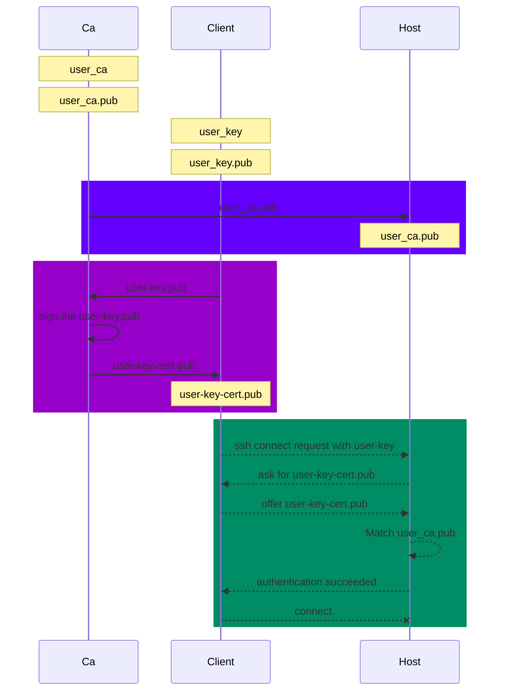

# `Host`信任`CA`的同时就信任所有它签名过的`client certificate`.

## 0.Use SSH user certificates

 使用ssh user certificate 的过程如图




实现效果

1.用户证书设计很巧妙，`Host`只保存一次`user_ca.pub` ，后续不再需要在这个`Host` 像传统的密钥对认证一样，再添加其他的`user-key.pub`。所以在AWS、AZURE,GCP里只需要在`userdata`初始化做一次即可，还可以直接做成image批量应用。

2.每个user 需求不同，而证书可以添加`metadata`，比如有效期，限制命令等，所以方便运维处理在需求提出阶段发行相应的证书即可;不用登陆每个`Host`吊销`user-key.pub`.

3.证书+Token认证，使用LAMBDA可以扩展成自动化处理。

4.对用户来说是认证过程透明的，认证时自动会寻找`user-key-cert.pub`（如果在～/.ssh下）.但是仅限于`openssh client`，`putty`等支持的不好，这一点限制了用户证书方案的使用。


## 1.建立USER CA证书

注意：`在CA服务器上操作，建立强密码，每次颁发时需要`

CA 证书建立时，host和user没有什么不同
```bash
#host和user分开建立，主要考虑管理方面。比如host更为稳定，轮换时间更长点？
ssh-keygen -t rsa -b 4096 -f user_ca -C user_ca
#存在/root/.ssh/user_ca

```
`user_ca`应妥善保存比如放在`KMS`

## 2.Configuring SSH for user certificate authentication
为用户证书认证 配置 SSH

注意：`在targaet host上操作`

Copy the three files you just generated to the server, store them under the /etc/ssh directory
使用`scp`或者`userdata`阶段拷贝这个文件到/etc/ssh都可以.

`user_ca.pub`

```bash

scp -p root@ca.host:/root/.ssh/user_ca.pub /etc/ssh/user_ca.pub
```
set the permissions to match the other files there, then add this line to your/etc/ssh/sshd_config file:

编辑sshd_config
```content
TrustedUserCAKeys /etc/ssh/user_ca.pub
```

重启服务生效
```bash
systemctl restart sshd
```

## 3.Issuing user certificates (to authenticate users to hosts)
颁发用户证书（以向主机验证用户身份）

注意：`在client操作，一般不用再设置密码`
```bash
$ ssh-keygen -f user-key -b 4096 -t rsa
$ ls -l ~/.ssh
-rw-------. 1 lance lance 3369 Mar 19 16:33 user-key
-rw-r--r--. 1 lance lance  737 Mar 19 16:33 user-key.pub
```

将`user-key.pub`发送给`CA`

然后`Ca`签名,生成user-key-cert.pub

注意：`在Ca操作`

```bash
ssh-keygen -s /root/.ssh/user_ca -I  client-root -n root -V +1d user-key.pub
$ ls -l
-rw-r--r--. 1 lance lance  737 Mar 19 16:33 user-key-cert.pub

```
`Ca`将`user-key-cert.pub`返回给`Client`


## 4.Client 使用cert 连接到host

注意：`在Clientc操作`

`user-key-cert.pub` 放在 `～/.ssh`，可以删除`user-key.pub`，会发现依然可以登陆。

```bash
ssh root@host1.550w.dev
```

<details><summary>使用ssh certificate 登陆过程debug</summary>


```bash
 ssh -v -i client-root root@host1.550w.dev
OpenSSH_8.4p1 Debian-5+deb11u1, OpenSSL 1.1.1n  15 Mar 2022
debug1: Reading configuration data /etc/ssh/ssh_config
debug1: /etc/ssh/ssh_config line 19: include /etc/ssh/ssh_config.d/*.conf matched no files
debug1: /etc/ssh/ssh_config line 21: Applying options for *
debug1: Connecting to host1.550w.dev [host1.550w.dev] port 22.
debug1: Connection established.
debug1: identity file client-root type 0
debug1: identity file client-root-cert type 4
debug1: Local version string SSH-2.0-OpenSSH_8.4p1 Debian-5+deb11u1
debug1: Remote protocol version 2.0, remote software version OpenSSH_8.2p1 Ubuntu-4
debug1: match: OpenSSH_8.2p1 Ubuntu-4 pat OpenSSH* compat 0x04000000
debug1: Authenticating to host1.550w.dev:22 as 'root'
debug1: SSH2_MSG_KEXINIT sent
debug1: SSH2_MSG_KEXINIT received
debug1: kex: algorithm: curve25519-sha256
debug1: kex: host key algorithm: ecdsa-sha2-nistp256
debug1: kex: server->client cipher: chacha20-poly1305@openssh.com MAC: <implicit> compression: none
debug1: kex: client->server cipher: chacha20-poly1305@openssh.com MAC: <implicit> compression: none
debug1: expecting SSH2_MSG_KEX_ECDH_REPLY
debug1: Server host key: ecdsa-sha2-nistp256 SHA256:K/AfVqzkE28xMvXpaCwYJPVTX6knS3hDBPD3/4p8ek8
debug1: Host 'host1.550w.dev' is known and matches the ECDSA host key.
debug1: Found key in /root/.ssh/known_hosts:1
debug1: rekey out after 134217728 blocks
debug1: SSH2_MSG_NEWKEYS sent
debug1: expecting SSH2_MSG_NEWKEYS
debug1: SSH2_MSG_NEWKEYS received
debug1: rekey in after 134217728 blocks
debug1: Will attempt key: client-root RSA SHA256:0eJKkr5yTdaJKKbT0eF5P8p+HPaoY8d9aDGgsP85qmk explicit
debug1: Will attempt key: client-root RSA-CERT SHA256:0eJKkr5yTdaJKKbT0eF5P8p+HPaoY8d9aDGgsP85qmk explicit
debug1: SSH2_MSG_EXT_INFO received
debug1: kex_input_ext_info: server-sig-algs=<ssh-ed25519,sk-ssh-ed25519@openssh.com,ssh-rsa,rsa-sha2-256,rsa-sha2-512,ssh-dss,ecdsa-sha2-nistp256,ecdsa-sha2-nistp384,ecdsa-sha2-nistp521,sk-ecdsa-sha2-nistp256@openssh.com>
debug1: SSH2_MSG_SERVICE_ACCEPT received
debug1: Authentications that can continue: publickey
debug1: Next authentication method: publickey
debug1: Offering public key: client-root RSA SHA256:0eJKkr5yTdaJKKbT0eF5P8p+HPaoY8d9aDGgsP85qmk explicit
debug1: Authentications that can continue: publickey
debug1: Offering public key: client-root RSA-CERT SHA256:0eJKkr5yTdaJKKbT0eF5P8p+HPaoY8d9aDGgsP85qmk explicit
debug1: Server accepts key: client-root RSA-CERT SHA256:0eJKkr5yTdaJKKbT0eF5P8p+HPaoY8d9aDGgsP85qmk explicit
debug1: Authentication succeeded (publickey).
Authenticated to host1.550w.dev ([host1.550w.dev]:22).
debug1: channel 0: new [client-session]
debug1: Requesting no-more-sessions@openssh.com
debug1: Entering interactive session.
debug1: pledge: network
debug1: client_input_global_request: rtype hostkeys-00@openssh.com want_reply 0
debug1: Remote: cert: key options: agent-forwarding port-forwarding pty user-rc x11-forwarding
debug1: Remote: cert: key options: agent-forwarding port-forwarding pty user-rc x11-forwarding
debug1: Sending environment.
debug1: Sending env LANG = zh_CN.UTF-8
Welcome to Ubuntu 20.04 LTS (GNU/Linux 5.4.0-48-generic x86_64)


```
</details>


## 5.Checking logs 检查日志
If you look in your server's sshd log (for example, by running journalctl -u sshd), you will see the name of the certificate being used for authentication, along with the fingerprint of the signing CA:

如果查看服务器的 sshd 日志（例如，通过运行 journalctl -u sshd ），您将看到用于身份验证的证书的名称以及签名 CA 的指纹：


